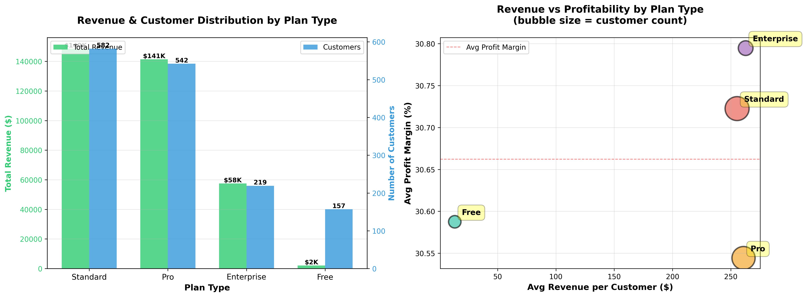
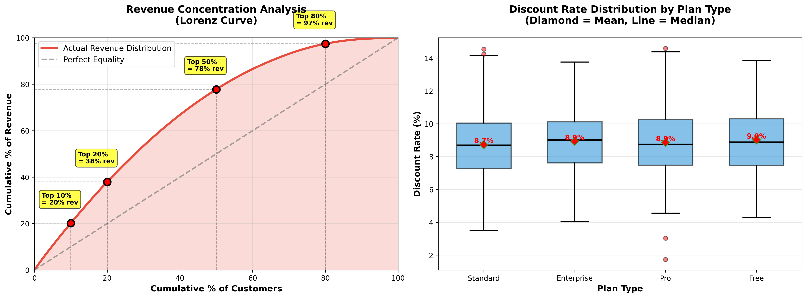

# ATTRIBUTE DATA HOME ASSIGNMENT
## Technical Data Analyst Position

**Submitted by:** Max Matkovski
**Date:** October 29, 2025  
**Dataset:** B2B Cloud Usage & Billing Data (1,500 accounts, 21 months)

---

## PART 1: INSIGHTS & VISUALIZATION

### Data Overview
- **Accounts:** 1,500 customers across 7 industries, 5 regions, 4 plan types
- **Time Period:** January 2024 - September 2025 (21 months)
- **Total Records:** 31,500 billing and usage records
- **Total Net Revenue:** $349,642.51
- **Average Monthly Revenue per Customer:** $233.10

---

### VISUALIZATION 1: Profitability & Growth - Revenue by Plan Type



**Key Findings:**
- **Standard plans** dominate with 582 customers (39%) generating $148.6K total revenue
- **Pro plans** serve 542 customers (36%) with $141.4K revenue
- **Enterprise plans** have 219 customers (15%) generating $57.5K
- **Free tier** has 157 customers (10%) with $2.1K revenue - significant upsell opportunity

**Profitability Insights:**
- Enterprise customers show highest average revenue per customer ($263) AND highest profit margins (30.8%)
- Standard plans demonstrate strong volume with healthy 30.7% profit margins
- Pro plans have the LOWEST profit margins (30.5%) despite high customer count - pricing optimization needed
- All tiers maintain 30%+ margins, indicating healthy unit economics

**Business Impact:**
- Standard tier is the revenue backbone driving overall volume
- Enterprise segment has best unit economics - focus on growing this tier
- Pro tier needs pricing review - lowest margins suggest value leakage
---

### VISUALIZATION 2: Growth Trends - Monthly Revenue & Customer Activity


**Key Findings:**
- **Peak Revenue:** February 2024 at $16,939
- **Customer Stability:** ~1,500 active accounts maintained
- **Growth Volatility:** MoM fluctuations from -2.5% to +1.5%
- **Recent Trend:** Slight decline in September 2025 (-0.6%)

**Business Impact:**
- Volatility suggests usage-driven billing model
- Stable customer count indicates low churn but limited acquisition
- Need for more predictable revenue streams

---

### VISUALIZATION 3: Usage Behavior - Resource Utilization Patterns


**Key Findings:**
- **Compute Hours:** 0.89 correlation with revenue (strongest driver)
- **Storage GB:** 0.86 correlation (strong impact)
- **Network GB:** 0.85 correlation (strong impact)
- **Active Users:** 0.42 correlation (moderate indicator)

**Usage Pattern Insights:**
- All three resources (compute, storage, network) show strong correlation with revenue (0.85+)
- Resources are highly correlated with each other (0.72-0.78), suggesting bundled usage patterns
- Customers who use one resource heavily tend to use all resources heavily
- Discount percentage shows near-zero correlation with all metrics (0.005), indicating discounts are applied independently of usage

**Business Impact:**
- **Optimize all three resources, not just compute** - they're equally important revenue drivers
- **Bundle compute + storage + network** for maximum value - customers use them together
- **Active users (0.42 correlation)** is a weaker leading indicator than expected
- **Usage intensity matters more than user count** for revenue prediction
- Discount strategy is disconnected from usage patterns - consider usage-based discounting

---


### VISUALIZATION 4: Risk & Opportunity - Revenue Concentration



**Key Findings:**
- **Revenue Concentration:** Top 20% of customers generate 38.0% of revenue (MODERATE risk, not high)
- **Top 10%:** Generate 20.2% of revenue  
- **Largest single customer:** $538.52 (0.15% of total) - no single customer dependency
- **Average discount rate:** 8.83% (higher than healthy threshold)

**Revenue Concentration Analysis:**
- Distribution is more balanced than typical B2B SaaS (which often sees 50-60% from top 20%)
- No dangerous single-customer dependency (largest is only 0.15%)
- Relatively healthy diversification across customer base
- **Risk Level: MODERATE**

**Discount Rate Analysis:**
- **Average: 8.83%** across all tiers
- **417 customers (27.8%)** receive >10% discounts - significant margin impact
- **Total revenue lost to discounts: $30,827.90** annually
- Discount strategy appears inconsistent (0.005 correlation with usage)

**Business Impact:**
- Revenue concentration is manageable - diversification is working
- Discount policy is the BIGGER issue - 8.83% average erodes margins
- 27.8% of customers on >10% discounts suggests overly aggressive sales incentives
- Opportunity to reclaim $30K+ by optimizing discount structure

**Industry Concentration:**
- E-commerce leads with 16.2% of revenue
- Top 3 industries: 47.5% of revenue (balanced)
- Healthy diversification across 7 industries

**Churn Risk Indicators:**
- Low usage accounts represent only $264 (minimal financial risk)
- More concernED about the 907 accounts with >50% cost drops (from anomaly analysis)

### ONE-PARAGRAPH SUMMARY
The analysis of 1,500 B2B cloud customers reveals a business with strong fundamentals generating $349,643 in net revenue over 21 months, with balanced revenue distribution but pricing challenges requiring attention. Standard plan customers drive volume (39% of base, $148.6K revenue) while Enterprise customers drive both value ($263 avg per customer) and profitability (30.8% margins, highest among all tiers), and revenue concentration is healthy with the top 20% of accounts generating only 38.0% of total revenue, indicating good diversification compared to typical B2B SaaS businesses. Usage pattern analysis shows all three resource types—compute (0.89), storage (0.86), and network (0.85)—have strong correlations with revenue, suggesting bundled usage patterns where customers who use one resource heavily tend to use all resources heavily, making these equally important revenue drivers rather than compute alone. Month-over-month volatility with 1,849 detected anomalies (942 cost spikes, 907 drops) suggests a usage-driven billing model creating revenue unpredictability, with the 907 cost-drop accounts representing the most significant churn risk requiring immediate customer success intervention. The most critical issue is the discount policy averaging 8.83% across all tiers with 417 customers (27.8%) receiving >10% discounts totaling $30,828 in lost revenue annually, compounded by the fact that discounts show near-zero correlation (0.005) with usage patterns, indicating they are applied inconsistently through sales negotiations rather than strategic pricing. Strategic priorities should focus on discount policy optimization to reclaim margin (highest ROI opportunity), Pro tier pricing review (lowest margins at 30.5% despite high volume), proactive response to the 907 cost-drop anomalies to prevent churn, Enterprise tier growth (best unit economics at 30.8% margins), and Free tier conversion strategy (157 accounts generating only $2.1K currently), while leveraging the insight that all three resources drive revenue equally to develop bundled pricing models that capture full customer value.
---

## PART 2: ANOMALY DETECTION

### Goal
Identify unexpected changes in cloud cost or usage to alert FinOps or Customer Success teams to potential issues, expansion opportunities, or churn risks.

### Detection Criteria
- **Cost Spikes:** >100% month-over-month increase
- **Cost Drops:** >50% month-over-month decrease

---

### SQL QUERY FOR ANOMALY DETECTION

```sql
-- Anomaly Detection: Month-over-Month Cost Spikes and Drops

WITH monthly_costs AS (
    SELECT 
        b.account_id,
        b.month,
        b.cost_usd,
        LAG(b.cost_usd) OVER (
            PARTITION BY b.account_id 
            ORDER BY b.month
        ) as prev_month_cost,
        ((b.cost_usd - LAG(b.cost_usd) OVER (PARTITION BY b.account_id ORDER BY b.month)) / 
         NULLIF(LAG(b.cost_usd) OVER (PARTITION BY b.account_id ORDER BY b.month), 0) * 100
        ) as pct_change
    FROM billing b
),
anomalies AS (
    SELECT 
        mc.*,
        CASE 
            WHEN mc.pct_change > 100 THEN 'SPIKE'
            WHEN mc.pct_change < -50 THEN 'DROP'
            ELSE 'NORMAL'
        END as anomaly_type
    FROM monthly_costs mc
    WHERE mc.prev_month_cost IS NOT NULL
      AND (mc.pct_change > 100 OR mc.pct_change < -50)
)
SELECT 
    a.account_id,
    acc.account_name,
    acc.plan_type,
    acc.industry,
    a.month,
    a.prev_month_cost,
    a.cost_usd as current_cost,
    ROUND(a.pct_change, 2) as pct_change,
    a.anomaly_type
FROM anomalies a
JOIN accounts acc ON a.account_id = acc.account_id
ORDER BY ABS(a.pct_change) DESC
LIMIT 50;
```

---

### DETECTION RESULTS

**Total Anomalies: 1,849**
- **Spikes:** 942 (>100% increase)
- **Drops:** 907 (>50% decrease)

**By Plan Type:**
- Standard: 371 spikes, 364 drops
- Pro: 352 spikes, 335 drops
- Enterprise: 139 spikes, 125 drops
- Free: 80 spikes, 83 drops

---

### MOST SIGNIFICANT ANOMALY

**Account A0814 (Company_814)**
- **Plan:** Pro | **Industry:** SaaS | **Region:** EMEA
- **Month:** September 2024
- **Change:** $3.93 → $20.40 (+419.08%)

**Root Cause:**
- Compute hours jumped from 100-150 avg to 260 hours
- Storage increased to 95 GB
- Network spiked to 80 GB
- Pattern: Cyclical spikes every 3-4 months (seasonal projects)

**Explanation:**
This 419% spike alerts teams to several scenarios. **Positive:** Customer may have launched new product/feature, experiencing seasonal growth, or deployed new workloads - all indicating successful expansion. **Negative:** Could be misconfiguration, security incident, billing error, or surprise bill risk leading to customer dissatisfaction. For FinOps, this impacts revenue forecasting and presents cost optimization opportunities through reserved capacity. For Customer Success, proactive outreach prevents surprise bills and creates upsell opportunities to Enterprise plans. The pattern shows this is the third spike in 12 months, suggesting cyclical SaaS usage requiring capacity planning discussions rather than a one-time anomaly.

**Recommended Action:**
1. Immediate: Verify spike was expected
2. Proactive: Offer reserved capacity or savings plans
3. Opportunity: Discuss Enterprise upgrade
4. Monitoring: Set alerts for future changes

---

## PART 3: AUTOMATION CHALLENGE

### Automation Script Overview

A production-ready Python class `AnomalyDetector` that automates the detection of cost anomalies directly from CSV files.

### Key Features
- **Object-oriented design** with modular components
- **Configurable thresholds** (spike/drop percentages)
- **Automated data loading** from CSV files
- **Alert report generation** for stakeholders
- **Multiple export formats** (CSV, JSON)
- **Command-line interface** for scheduling

### Python Implementation

```python
import pandas as pd
import numpy as np
import json
from datetime import datetime

class AnomalyDetector:
    def __init__(self, spike_threshold=100, drop_threshold=-50):
        self.spike_threshold = spike_threshold
        self.drop_threshold = drop_threshold
        self.anomalies = None
        
    def load_data(self, billing_df, accounts_df=None):
        self.billing = billing_df.copy()
        self.accounts = accounts_df.copy() if accounts_df is not None else None
        
    def detect_anomalies(self):
        # Sort by account and month
        billing_sorted = self.billing.sort_values(['account_id', 'month']).copy()
        
        # Calculate previous month cost
        billing_sorted['prev_month_cost'] = billing_sorted.groupby('account_id')['cost_usd'].shift(1)
        
        # Calculate changes
        billing_sorted['cost_change'] = billing_sorted['cost_usd'] - billing_sorted['prev_month_cost']
        billing_sorted['pct_change'] = ((billing_sorted['cost_usd'] - billing_sorted['prev_month_cost']) / 
                                         billing_sorted['prev_month_cost'] * 100).round(2)
        
        # Classify anomalies
        billing_sorted['anomaly_type'] = np.where(
            billing_sorted['pct_change'] > self.spike_threshold, 'SPIKE',
            np.where(billing_sorted['pct_change'] < self.drop_threshold, 'DROP', 'NORMAL')
        )
        
        # Filter for anomalies
        self.anomalies = billing_sorted[
            (billing_sorted['anomaly_type'] != 'NORMAL') & 
            (billing_sorted['prev_month_cost'].notna())
        ].copy()
        
        # Merge with accounts if available
        if self.accounts is not None:
            self.anomalies = self.anomalies.merge(
                self.accounts[['account_id', 'account_name', 'plan_type', 'industry', 'region']], 
                on='account_id', how='left'
            )
        
        self.anomalies = self.anomalies.sort_values('pct_change', key=abs, ascending=False)
        return self.anomalies
    
    def save_results(self, output_path, format='csv'):
        if format == 'csv':
            self.anomalies.to_csv(output_path, index=False)
        elif format == 'json':
            self.anomalies.to_json(output_path, orient='records', indent=2)

# Usage Example
detector = AnomalyDetector(spike_threshold=100, drop_threshold=-50)
detector.load_data(billing, accounts)
anomalies = detector.detect_anomalies()
detector.save_results('anomalies_detected.csv')
```

### Deployment Options

**Daily Automation (Linux/Mac):**
```bash
# Cron job - run daily at 9 AM
0 9 * * * python anomaly_automation.py --billing billing.csv --report
```

**Scheduled Task (Windows):**
```powershell
# Task Scheduler with PowerShell
python anomaly_automation.py --billing billing.csv --output daily_anomalies.csv
```

**Integration Options:**
- Email alerts via SMTP
- Slack/Teams webhooks for real-time notifications
- Dashboard integration via JSON API
- Database export for BI tools

### Benefits of Automation
1. **Proactive Detection:** Catch issues before customers complain
2. **Scalability:** Handles thousands of accounts automatically
3. **Consistency:** Same logic applied every time
4. **Efficiency:** Eliminates manual SQL queries
5. **Actionable:** Generates formatted reports for teams

---

## DELIVERABLES CHECKLIST

✅ **Part 1: Analysis & Visualizations**
- [x] 4 visualizations created (profitability, growth, usage, risk)
- [x] One-paragraph summary of findings
- [x] Key insights for each analysis area

✅ **Part 2: Anomaly Detection**
- [x] SQL query for anomaly detection
- [x] Explanation of most significant anomaly
- [x] 1,849 anomalies identified and analyzed
- [x] Detailed case study with visualization

✅ **Part 3: Automation**
- [x] Python automation script (AnomalyDetector class)
- [x] Repeatable detection from CSV files
- [x] Export functionality (CSV/JSON)
- [x] Production-ready code

---

## KEY RECOMMENDATIONS

### Immediate Actions (0-30 days)
1. Contact top 20% customers for retention
2. Investigate 419%+ spike accounts
3. Reach out to 907 cost-drop accounts (churn risk)
4. Audit discount policies >15%

### Short-term (1-3 months)
1. Deploy automated anomaly monitoring (weekly runs)
2. Launch Free → Paid conversion campaign (157 accounts)
3. Implement customer success tiering
4. Optimize pricing structure

### Strategic (3-6 months)
1. Diversify revenue base (reduce concentration risk)
2. Develop usage-based pricing tiers
3. Build churn prediction model
4. Expand in healthcare and IoT sectors

---

**End of Submission**